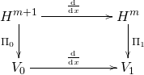

# One Reduced Scalar Spin Vlasov-Maxwell

- Yingzhe Li 
  - University of Chinese Academy of Sciences, Beijing 100049, CHINA
  - LSEC, Academy of Mathematics and Systems Science, Chinese Academy of Sciences, Beijing 100190,  CHINA

## Spin Vlasov-Maxwell equations

The dimensionless non-relativistic spin Vlasov-Maxwell system is

#### [Vlasov equation](@id vlasov)

```math
\begin{gather}
\frac{\partial f}{\partial t}+{\bf v}\cdot\frac{\partial f}{\partial{\bf x}}+[\left({\bf E}+{\bf v}\times{\bf B}\right) - \nabla({\bf s} \cdot {\bf B})]\cdot\frac{\partial f}{\partial{\bf v}} - ({\bf s}\times {\bf B}) \cdot \frac{\partial f}{\partial {\bf s}} = 0, \label{eq:Vlasovn}\\
\frac{\partial{\bf E}}{\partial t}  =  \nabla\times{\bf B}-{\bf J}, \label{eq:MaxwellEn} \\
\frac{\partial{\bf B}}{\partial t}  =  - \nabla\times{\bf E} \label{eq:MaxwellBn}  \\
\nabla\cdot{\bf E}  = \rho-1, \label{eq:divEn} \\
\nabla\cdot{\bf B}  = 0 \label{eq:divBn}
\end{gather}
```

with ${\bf J}({\bf x}, t) =\int_{\mathbb{R}^3\times \mathbb{R}^3} {\bf v}f({\bf x}, {\bf v},{\bf s}, t) \mathrm{d}{\bf v}\mathrm{d}{\bf s} - \nabla \times {\bf M}({\bf x}, t)$, ${\bf M}({\bf x}, t) = \int_{\mathbb{R}^3\times \mathbb{R}^3} {\bf s}f({\bf x}, {\bf v},{\bf s}, t) \mathrm{d}{\bf v}\mathrm{d}{\bf s}$, $\rho({\bf x}, t)=\int_{\mathbb{R}^3} f({\bf x}, {\bf v},{\bf s}, t) \mathrm{d}{\bf v}\mathrm{d}{\bf s}$, $\nabla$ here represents the gradient about ${\bf x}$.


Denote $\mathcal{M}$ the infinite dimensional manifold $\left\{(f, {\bf E},{\bf B})|\, \nabla\cdot{\bf B}=0\right\}$. Spin Vlasov-Maxwell system can be expressed with the Poisson bracket[^1] in the purpose of   using the idea of geometric numerical integration[^3]. For  two functionals $\mathcal{F}$ and $\mathcal{G}$ defined on ${\mathcal M}$,  we introduce  the  Poisson
bracket presented in [^1].

```math
\begin{align}\label{eq:MMWB}
\begin{split}
\{\mathcal{F},\mathcal{G}\} &= \{\mathcal{F}, \mathcal{G}\}_{VM} + \{ \mathcal{F}, \mathcal{G}\}_{s}\\
&=
\int_{\Omega} f\left[\frac{\delta\mathcal{F}}{\delta f},\frac{\delta\mathcal{G}}
{\delta f}\right]_{\mathbf{xv}}\mathrm{d}\mathbf{x}\mathrm{d}\mathbf{v}d\mathbf{s}
  +\int_{\Omega} \left(\frac{\delta\mathcal{F}}{\delta\mathbf{E}}\cdot\frac{\partial f}{\partial\mathbf{v}}\frac{\delta\mathcal{G}}{\delta f}-\frac{\delta\mathcal{G}}{\delta\mathbf{E}}\cdot\frac{\partial f}{\partial\mathbf{v}}\frac{\delta\mathcal{F}}{\delta f}\right)\mathrm{d}\mathbf{x}\mathrm{d}\mathbf{v}\mathrm{d}\mathbf{s}\\
  &+\int_{\Omega_{\bf x}}\left(\frac{\delta\mathcal{F}}{\delta\mathbf{E}}\cdot\left(\triangledown\times\frac{\delta\mathcal{G}}{\delta\mathbf{B}}\right)
          -\frac{\delta\mathcal{G}}{\delta\mathbf{E}}\cdot
 \left(\triangledown\times\frac{\delta\mathcal{F}}{\delta\mathbf{B}}\right)\right)\mathrm{d}\mathbf{x}\\
 &+\int_{\Omega} f{\bf B}\cdot\left(\frac{\partial}{\partial\mathbf{v}}\frac{\delta\mathbf{\mathrm{\mathcal{F}}}}{\delta f}\times\frac{\partial}{\partial\mathbf{v}}\frac{\delta\mathcal{G}}{\delta f}\right)\mathrm{d}\mathbf{x}\mathrm{d}\mathbf{v}\mathrm{d}\mathbf{s} + \{ \mathcal{F}, \mathcal{G}\}_{s},
 \end{split}
\end{align}
```

```math
\{ \mathcal{F}, \mathcal{G}\}_{s} = \int_{\Omega} f{\bf s} \cdot (\frac{\partial }{\partial {\bf s}}\frac{\delta \mathcal{F}}{\delta f} \times \frac{\partial }{\partial {\bf s}} \frac{\delta \mathcal{G}}{\delta f})\mathrm{d}\mathbf{x}\mathrm{d}\mathbf{v}\mathrm{d}\mathbf{s}.
```


Here, $\left[\cdot,\cdot\right] _{\mathbf{xv}}$
denotes the Lie bracket for  two functions of $\left({\bf x},{\bf v}\right)$.
It has been proved in [^1] that the bracket(\ref{eq:MMWB}) is Poisson. With  the  Hamiltonian functional defined  by

```math
\begin{equation}
\mathcal{H}(f,\mathbf{E},\mathbf{B})=\frac{1}{2}\int_{\Omega} \mathbf{v}{}^{2}fd\mathbf{x}d\mathbf{v}d\mathbf{s}+\int_{\Omega} {\bf s}\cdot {\bf B} fd\mathbf{x}d\mathbf{v}d\mathbf{s}+ \frac{1}{2}\int_{\Omega_{\bf x}}
\left( |\mathbf{E}|^{2}+|\mathbf{B}|^{2}\right)d\mathbf{x}\label{eq:HamiltonVM}
\end{equation}
```


the spin Vlasov-Maxwell system of equations (\ref{eq:Vlasovn}-\ref{eq:MaxwellBn})  is equivalent to

```math
\begin{equation}
 \frac{\partial{\mathcal Z}}{\partial t}=\{\mathcal{Z},\mathcal{H}\},\label{eq:PoissonVM}
\end{equation}
```

where $\mathcal{Z}\in \mathcal{M}$.

## Hamiltonian splitting method


As in paper [^4], we here adopt Hamiltonian splitting method to the spin Vlasov-Maxwell equations.
Hamiltonian is split into 8 parts as follows,

```math
\begin{align}
\mathcal{H}(f,\mathbf{E},\mathbf{B})&=\frac{1}{2}\int_{\Omega} {v}_1^{2}fd\mathbf{x}d\mathbf{v}d\mathbf{s}+\frac{1}{2}\int_{\Omega} {v}_2^{2}fd\mathbf{x}d\mathbf{v}d\mathbf{s}+\frac{1}{2}\int_{\Omega} {v}_3^{2}fd\mathbf{x}d\mathbf{v}d\mathbf{s}\\
&+\int_{\Omega} {s_1}\cdot {B_1} fd\mathbf{x}d\mathbf{v}d\mathbf{s}+ \int_{\Omega} {s_2}\cdot {B_2} fd\mathbf{x}d\mathbf{v}d\mathbf{s}+
\int_{\Omega} {s_3}\cdot {B_3} fd\mathbf{x}d\mathbf{v}d\mathbf{s}\\
&+\frac{1}{2}\int_{\Omega_{\bf x}}
 |\mathbf{E}|^{2}d\mathbf{x} + \frac{1}{2}\int_{\Omega_{\bf x}}
 |\mathbf{B}|^{2}d\mathbf{x}\\
 &=: H_{1f}+H_{2f}+H_{3f} + H_{s1}+H_{s2}+H_{s3}+H_E+H_B.
\end{align}
```

The subsystem corresponding to $H_{s1}$ is as follows.

```math
\begin{align}
&\frac{\partial f}{\partial t} -  \nabla_x (s_1 B_1) \cdot \frac{\partial f}{\partial {\bf v}}-s_3B_1 \frac{\partial f }{\partial s_2} + s_2B_1\frac{\partial f}{\partial s_3} = 0\\
&\frac{\partial {\bf E}}{\partial t} = \nabla_x \times \int {\bf a} f d{\bf v}d{\bf s}\\
&\frac{\partial {\bf B}}{\partial t} = 0,
\end{align}
```

where ${\bf a} = (s_1, 0 , 0)^{T}$.

## Reduced spin Vlasov--Maxwell equations

Here we reduce the system (\ref{eq:Vlasovn})-(\ref{eq:divBn}) by the similar manner in [^5]. 
The reduced spin Vlasov--Maxwell system is

```math
\begin{equation}
\begin{aligned}
&\frac{\partial f}{\partial t} + p \frac{\partial f}{\partial x} + [ E_x - s_2 \frac{\partial^2 A_z}{\partial x^2} + s_3 \frac{\partial^2 A_y}{\partial x^2}  - {\mathbf A}_\perp \cdot \frac{\partial {\mathbf A}_\perp}{\partial x} ]\frac{\partial f}{\partial p}  + [s_3 \frac{\partial A_z}{\partial x} + s_2 \frac{\partial A_y}{\partial x}, -s_1 \frac{\partial A_y}{\partial x}, -s_1 \frac{\partial A_z}{\partial x} ] \cdot \frac{\partial f}{\partial {\mathbf s}} = 0,\\
&\frac{\partial E_x}{\partial x} = -\int p f  \mathrm{d}\mathrm{p}\mathrm{d}\mathrm{\mathbf s},\\
&\frac{\partial E_y}{\partial t} = - \frac{\partial^2 A_y}{\partial x^2} + A_y \int  f  \mathrm{d}\mathrm{p}\mathrm{d}\mathrm{\mathbf s} + \int s_3 \frac{\partial f}{\partial x}\mathrm{d}\mathrm{p}\mathrm{d}\mathrm{\mathbf s},\\
&\frac{\partial E_z}{\partial t} = - \frac{\partial^2 A_z}{\partial x^2} + A_z \int  f  \mathrm{d}\mathrm{p}\mathrm{d}\mathrm{\mathbf s} - \int s_2 \frac{\partial f}{\partial x}\mathrm{d}\mathrm{p}\mathrm{d}\mathrm{\mathbf s},\\
& \frac{\partial {\mathbf A}_\perp}{\partial t} = - {\mathbf E}_\perp,\\
&\frac{\partial E_x}{\partial t} = \int f \mathrm{d}\mathrm{p}\mathrm{d}\mathrm{\mathbf s} - 1.
\end{aligned}
\label{eq:reduced}
\end{equation}
```

Particle distribution function is  $f(x, p, {\mathbf s}, t)$, $x, p $ are scalars, ${\mathbf s} \in \mathbb{R}^3$, ${\mathbf E} = (E_x, {\mathbf E}_\perp) = (E_x, E_y, E_z)$, and ${\mathbf A} = (A_x, {\mathbf A}_\perp) = (0, A_y, A_z)$.

This reduced spin Vlasov-Maxwell system can be expressed with one Poisson 
bracket as follows. For any two functionals $\mathcal{F}$, and $\mathcal{G}$ depend on $f, {\mathbf E}$, and ${\mathbf A}_\perp$, we have

```math
\begin{equation}
\begin{aligned}
\{ \mathcal{F}, \mathcal{G}\} &= \int_{\Omega} f\left[\frac{\delta\mathcal{F}}{\delta f},\frac{\delta\mathcal{G}}
{\delta f}\right]_{{xp}}\mathrm{d}{x}\mathrm{d}{p}\mathrm{d}\mathbf{s}
  +\int_{\Omega} \left(\frac{\delta\mathcal{F}}{\delta {E_x}}\frac{\partial f}{\partial {p}}\frac{\delta\mathcal{G}}{\delta f}-\frac{\delta\mathcal{G}}{\delta {E_x}}\frac{\partial f}{\partial {p}}\frac{\delta\mathcal{F}}{\delta f}\right)\mathrm{d}{x}\mathrm{d}{p}\mathrm{d}\mathbf{s}\\
&+ \int_{\Omega} \left( \frac{\delta \mathcal{G}}{\delta {\mathbf A}_\perp} \cdot  \frac{\delta \mathcal{F}}{\delta {\mathbf E}_\perp} - \frac{\delta \mathcal{F}}{\delta {\mathbf A}_\perp} \cdot  \frac{\delta \mathcal{G}}{\delta {\mathbf E}_\perp}\right) \mathrm{d}x + \int_{\Omega} f {\mathbf s}\cdot \left( \frac{\partial}{\partial {\mathbf s}}\frac{\delta \mathcal{F}}{\delta {f}} \times \frac{\partial}{\partial {\mathbf s}}\frac{\delta \mathcal{G}}{\delta {f}} \right) \mathrm{d}x\mathrm{d}p\mathrm{d}{\mathbf s}.
\end{aligned}
\label{eq:poisson}
\end{equation}
```

With the Hamiltonian functional defined by 

```math
\begin{equation}
\begin{aligned}
\mathcal{H}(f, {\mathbf E}, {\mathbf A}_\perp) &= \frac{1}{2}\int_{\Omega} p^2 f \mathrm{d}x\mathrm{d}p\mathrm{d}{\mathbf s} + \frac{1}{2}\int_{\Omega}|{\mathbf A}_\perp|^2 f \mathrm{d}x\mathrm{d}p\mathrm{d}{\mathbf s}\\
& + \frac{1}{2}\int_{\Omega_x} |{\mathbf E}|^2 + |\frac{\partial {\mathbf A}_\perp}{\partial x}|^2 \mathrm{d}x + \int_{\Omega} \left( - s_2 \frac{\partial A_z}{\partial x} + s_3 \frac{\partial A_y}{\partial x} \right) f \mathrm{d}x\mathrm{d}p\mathrm{d}{\mathbf s},
\end{aligned}
\end{equation} 
```

the reduced spin Vlasov-Maxwell system of equations (\ref{eq:reduced}) is equivalent to $$\frac{\partial \mathcal{Z}}{\partial t} = \{ \mathcal{Z}, \mathcal{H} \}.$$

## GEMPIC framework applied to reduced spin Vlasov system.

We consider the components of the electromagnetic fields separately and we have that $E_x$ is a 1-form, $E_y, E_z, A_y, A_z$ are 0-forms. There is a commuting diagram for involved function spaces in one spatial dimension with continuous spaces in the upper line and discrete subspaces in the lower line. The connection between the two sequences is made by the projectors $\Pi_0$ and $\Pi_1$.

```math
\begin{xy}
 \xymatrix{
    H^{m+1} \ar[rr]^{\frac{\mathrm{d}}{\mathrm{d} x}}\ar[d]_{\Pi_0} & & H^m \ar[d]^{\Pi_1} \\
      V_0  \ar[rr]^{\frac{\mathrm{d}}{\mathrm{d} x}} && V_1
    }
\end{xy}
```



The basis for each of the finite dimensional spaces $V_0, V_1$, with dim $V_k = N_k$ is denoted by $\{ \Lambda^0_I\}_{I=1,\cdots,N_0} $, and $\{ \Lambda^1_I\}_{I=1,\cdots,N_1} $. The dual bases of $V_0$ and $V_1$ are $\{\Sigma^0_I\}_{I=1,\cdots, N_0} $, and $\{\Sigma^1_I\}_{I=1,\cdots, N_1} $ respectively, i.e.,  $\int_{\Omega_x} \Sigma^k_I \Lambda^k_J \mathrm{d}x = \delta_{IJ}, k = 0, 1$. $\frac{\mathrm{d}}{\mathrm{d} x}$ is a linear operator, i.e., 

```math
\frac{\mathrm{d}}{\mathrm{d} x}: V_0 \rightarrow V_1.
```

Operator $\frac{\mathrm{d}}{\mathrm{d} x}$ can be expressed by a matrix $\mathbb{C}$:

```math
\frac{\mathrm{d}}{\mathrm{d} x} \left(\Lambda^0_1, \cdots, \Lambda^0_{N_0} \right)  = \left(\Lambda^1_1, \cdots, \Lambda^1_{N_1} \right) \mathbb{C}_{N_1 N_0}.
```

### B-splines

Assume $\Omega_x = [0, L]$, and there is one equidistant grid on $\Omega_x$,

```math
x_j = (j-1)\Delta x, \Delta x = L/M, j = 1, \cdots, M.
```

We can choose the following $\{\Lambda^0_I\}_{I=1,\cdots,N_0}$, and $\{\Lambda^1_I\}_{I=1,\cdots, N_1}$ as the basis functions for $V_0$, and $V_1$ respectively.

```math
\begin{align}
\Lambda^0_j = N_j^3(x) = \frac{1}{6} \left\{ 
\begin{aligned}
&\left(2 - \frac{|x - x_{j+2}|}{\Delta x} \right)^3, \quad 1 \le \frac{|x-x_{j+2}|}{\Delta x} \le 2,\\
&4 - 6 \left(\frac{|x-x_{j+2}|}{\Delta x}\right)^2 + 3 \left( \frac{|x-x_{j+2}|}{\Delta x}\right)^3, \quad 0 \le \frac{|x-x_{j+2}|}{\Delta x} \le 1,\\
&0, \quad \text{otherwise.}
\end{aligned}
\right.
\end{align}
```

```math
\begin{align}
\Lambda^1_j = N_j^2(x) = \frac{1}{2} \left\{ 
\begin{aligned}
&\left(\frac{x - x_j}{\Delta x} \right)^2, \quad 0 \le \frac{x-x_j}{\Delta x} \le 1,\\
& - 2 \left(\frac{x-x_j}{\Delta x}\right)^2 + 6 \left( \frac{x-x_j}{\Delta x}\right) - 3, \quad 1 \le \frac{x-x_j}{\Delta x} \le 2,\\
& (3 - \frac{x-x_j}{\Delta x})^2, \quad 2 \le \frac{x-x_j}{\Delta x} \le 3,\\
&0, \quad \text{otherwise.}
\end{aligned}
\right.
\end{align}
```

There is one relation between $\Lambda^k, k = 0, 1$,

```math
\frac{\mathrm{d}}{\mathrm{d}x} N^3_j(x) = \frac{1}{\Delta x}\left(N^2_j(x) - N^2_{j+1}(x)  \right),
```

which gives 

```math
\begin{equation}
\mathbb{C} = \frac{1}{\Delta x}
\begin{aligned}
\left(
\begin{matrix}
     1  & 0  & 0 & 0& \cdots & 0 & -1\\
     -1 & 1 & 0 & 0& \cdots & 0 & 0\\
     0  & -1 & 1 & 0& \cdots& 0 & 0\\
     0  & 0  & \ddots &\ddots &\ddots & \vdots & \vdots\\
      \vdots & \vdots & \ddots & \ddots & \ddots &\ddots & \vdots\\
     \vdots & \vdots & \vdots & \ddots & \ddots& \ddots &0\\
     0 & 0 & 0 & \cdots & 0& -1 & 1
\end{matrix}
\right)
\end{aligned}
\end{equation}
```

### Notations

Before deriving the discretization of functional derivatives, we introduce several notations which will make the formulas simpler.

```math
\begin{align}
\begin{aligned}
& \mathbb{R}^k({\mathbf{X}})_{N_p N_k} = 
\left(
\begin{matrix}
     \Lambda^k_1(x_1)  & \cdots  & \Lambda^k_{N_k}(x_1) \\
     \Lambda^k_1(x_2)  & \cdots  & \Lambda^k_{N_k}(x_2) \\
      \vdots  & \vdots  & \vdots \\
       \Lambda^k_1(x_{N_p})  & \cdots  & \Lambda^k_{N_k}(x_{N_p})
      \end{matrix}
\right), k = 0, 1.\\
&\mathbb{M}^k({\mathbf{X}})_{N_k N_k} = 
\left(
\begin{matrix}
     \int \Lambda^k_1(x)\Lambda^k_1(x)\mathrm{d}x  & \cdots  & \int \Lambda^k_1(x)\Lambda^k_{N_k}(x)\mathrm{d}x \\
     \int \Lambda^k_2(x)\Lambda^k_1(x)\mathrm{d}x  & \cdots  & \int \Lambda^k_2(x)\Lambda^k_{N_k}(x)\mathrm{d}x \\
      \vdots  & \vdots  & \vdots \\
      \int \Lambda^k_{N_k}(x)\Lambda^k_{1}(x)\mathrm{d}x  & \cdots  & \int \Lambda^k_{N_k}(x)\Lambda^k_{N_k}(x)\mathrm{d}x
      \end{matrix}
\right), k = 0, 1.\\
&\mathbb{N}^k({x_a})_{N_k N_k} = 
\left(
\begin{matrix}
      \Lambda^k_1(x_a)\Lambda^k_1(x_a)  & \cdots  & \Lambda^k_1(x_a)\Lambda^k_{N_k}(x_a) \\
      \Lambda^k_2(x_a)\Lambda^k_1(x_a)  & \cdots  &  \Lambda^k_2(x_a)\Lambda^k_{N_k}(x_a) \\
      \vdots  & \vdots  & \vdots \\
       \Lambda^k_{N_k}(x_a)\Lambda^k_{1}(x_a)  & \cdots  &  \Lambda^k_{N_k}(x_a)\Lambda^k_{N_k}(x_a)
      \end{matrix}
\right), k = 0, 1.\\
&\mathbb{M}_{p, N_p N_p} = 
\text{diag}(\omega_1, \cdots, \omega_{N_p}), \mathbb{S}_{3N_p 3N_p} = \text{diag}(\mathbb{S}_1, \cdots, \mathbb{S}_{N_p}),\\
&\mathbb{S}_a = \frac{1}{\omega_a}
\left(
\begin{matrix}
     0 & s_{a,3}  & -s_{a,2} \\
      -s_{a,3}  & 0  & s_{a,1} \\
      s_{a,2}  & -s_{a,1}  & 0 
      \end{matrix}
\right), \\
&{\Lambda^k{(x_a)}} = (\Lambda^k_1(x_a), \cdots, \Lambda^k_{N_k}(x_a))^{\mathrm{T}}, k = 1, 2.\\
&{\mathbf{X}} = (x_1, \cdots, x_{N_p})^{\mathrm{T}},\\
&{\mathbf{P}} = (p_1, \cdots, p_{N_p})^{\mathrm{T}},\\
&{\mathbf{S}} = (s_{1,1}, s_{1,2}, s_{1,3} \cdots, s_{a,1}, s_{a,2}, s_{a,3}, \cdots, s_{N_p,1}, s_{N_p,2}, s_{N_p,3})^{\mathrm{T}},\\
&{\mathbf{S}}_1 = (s_{1,1}, \cdots, s_{a,1}, \cdots, s_{N_p,1})^{\mathrm{T}},\\
&{\mathbf{S}}_2 = (s_{1,2}, \cdots, s_{a,2}, \cdots, s_{N_p,2})^{\mathrm{T}},\\
&{\mathbf{S}}_3 = (s_{1,3}, \cdots, s_{a,3}, \cdots, s_{N_p,3})^{\mathrm{T}},\\
&{\mathbf{e}}_x = (e_{x,1}, \cdots, e_{x,N_1})^{\mathrm{T}},\\
&{\mathbf{e}}_y = (e_{y,1}, \cdots, e_{y,N_0})^{\mathrm{T}},\\
&{\mathbf{e}}_z = (e_{z,1}, \cdots, e_{z,N_0})^{\mathrm{T}},\\
&{\mathbf{a}}_y = (a_{y,1}, \cdots, a_{y,N_0})^{\mathrm{T}},\\
&{\mathbf{a}}_z = (a_{z,1}, \cdots, a_{z,N_0})^{\mathrm{T}}.
\end{aligned}
\end{align}
```

### Discretization of the functional derivatives

As $E_{x, h} = \sum_{I=1}^{N_1}e_{x,I}\Lambda_{I}^1(x)$, any functional $\mathcal{F}[E_{x,h}]$ can be considered as a function $F({\mathbf e}_x)$ of the finite element coefficients, 

```math
\mathcal{F}[E_{x,h}] = F({\mathbf{e}}_x).
```

From [^2], we know that 

```math
\begin{equation}
\frac{\delta \mathcal{F}[E_{x,h}]}{\delta E_x} = \sum_{I=1}^{N_1} \frac{\partial F ({\mathbf e}_x)}{\partial e_{x,I}}\Sigma_I^1(x) = \sum_{I,J=1}^{N_1}\frac{\partial F ({\mathbf e}_x)}{\partial e_{x,I}} (\mathbb{M}_1)^{-1}_{IJ}\Lambda_J^1(x).
\end{equation}
```

Similarly, we have

```math
\begin{equation}
\begin{aligned}
\frac{\delta \mathcal{F}[E_{y,h}]}{\delta E_y} = \sum_{I=1}^{N_0} \frac{\partial F ({\mathbf e}_y)}{\partial e_{y,I}}\Sigma_I^0(x) = \sum_{I,J=1}^{N_0}\frac{\partial F ({\mathbf e}_y)}{\partial e_{y,I}} (\mathbb{M}_0)^{-1}_{IJ}\Lambda_J^0(x),\\
\frac{\delta \mathcal{F}[E_{z,h}]}{\delta E_z} = \sum_{I=1}^{N_0} \frac{\partial F ({\mathbf e}_z)}{\partial e_{z,I}}\Sigma_I^0(x) = \sum_{I,J=1}^{N_0}\frac{\partial F ({\mathbf e}_z)}{\partial e_{z,I}} (\mathbb{M}_0)^{-1}_{IJ}\Lambda_J^0(x),\\\frac{\delta \mathcal{F}[A_{y,h}]}{\delta A_y} = \sum_{I=1}^{N_0} \frac{\partial F ({\mathbf a}_y)}{\partial a_{y,I}}\Sigma_I^0(x) = \sum_{I,J=1}^{N_0}\frac{\partial F ({\mathbf a}_y)}{\partial a_{y,I}} (\mathbb{M}_0)^{-1}_{IJ}\Lambda_J^0(x),\\
\frac{\delta \mathcal{F}[A_{z,h}]}{\delta A_z} = \sum_{I=1}^{N_0} \frac{\partial F ({\mathbf a}_z)}{\partial a_{z,I}}\Sigma_I^0(x) = \sum_{I,J=1}^{N_0}\frac{\partial F ({\mathbf a}_z)}{\partial a_{z,I}} (\mathbb{M}_0)^{-1}_{IJ}\Lambda_J^0(x).
\end{aligned}
\end{equation}
```

We assume a particle-like distribution function for $N_p$ particles labelled by  a, 

```math
f_h(x,p,{\mathbf s}, t) = \sum_{a=1}^{N_p}\omega_a \delta(x-x_a(t))\delta(p-p_a(t))\delta({\mathbf s}-{\mathbf s}_a(t)).
```

One functional of the distribution function, $\mathcal{F}[f]$ can be considered as a function of the particle phase space trajectories, $F({\mathbf{X}}, {\mathbf{P}}, {\mathbf{S}})$.
From [^2], we know that 

```math
\frac{\partial F}{\partial x_a} = \omega_a \frac{\partial}{\partial x}\frac{\delta \mathcal{F}}{\delta f}|_(x_a, p_a, {\mathbf s}_a), \frac{\partial F}{\partial p_a} = \omega_a \frac{\partial}{\partial p}\frac{\delta \mathcal{F}}{\delta f}|_(x_a, p_a, {\mathbf s}_a), \frac{\partial F}{\partial {\mathbf s}_a} = \omega_a \frac{\partial}{\partial {\mathbf s}_a}\frac{\delta \mathcal{F}}{\delta f}|_(x_a, p_a, {\mathbf s}_a).
```

## Discrete Poisson bracket

Substituting the variational derivatives in last subsection into (\ref{eq:poisson}) gives the following discrete Poisson bracket,

```math
\begin{equation}\label{eq:dis}
\{ F, G \} = \left( \nabla_{\mathbf u}F\right)^{\mathrm{T}} \mathbb{J}({\mathbf u})\nabla_{\mathbf u}G,
\end{equation}
```

where ${\mathbf u} = ({\mathbf X}, {\mathbf P}, {\mathbf S}, {\mathbf e}_x, {\mathbf e}_y, {\mathbf e}_z, {\mathbf a}_y, {\mathbf a}_z)^{\mathrm{T}}$.
The matrix $\mathbb{J}$ is

```math
\begin{align}\label{eq:dispoisson}
\begin{aligned}
& \mathbb{J}({\mathbf{u}}) = 
\left(
\begin{matrix}
    {\mathbf{0}} & {\mathbb{M}}_p^{-1}  &{\mathbf{0}} & {\mathbf{0}} & {\mathbf{0}} & {\mathbf{0}}& {\mathbf{0}}  & {\mathbf{0}}\\
     -{\mathbb{M}}_p^{-1}  &{\mathbf{0}}   & {\mathbf{0}} & \mathbb{R}^1({\mathbf {X}})\mathbb{M}_1^{-1} & {\mathbf{0}} & {\mathbf{0}} & {\mathbf{0}} & {\mathbf{0}}\\
      {\mathbf{0}}  & {\mathbf{0}}  & \mathbb{S} & {\mathbf{0}} & {\mathbf{0}} & {\mathbf{0}} & {\mathbf{0}} & {\mathbf{0}} \\
       {\mathbf{0}}  & -{\mathbb{M}}_1^{-1}\mathbb{R}^1({\mathbf{X}})^{\mathrm{T}}  & {\mathbf{0}} & {\mathbf{0}}& {\mathbf{0}}& {\mathbf{0}}& {\mathbf{0}}& {\mathbf{0}}\\
       {\mathbf{0}}& {\mathbf{0}}& {\mathbf{0}}& {\mathbf{0}}& {\mathbf{0}}& {\mathbf{0}}&{\mathbb{M}}_0^{-1}&{\mathbf{0}}\\
       {\mathbf{0}}&{\mathbf{0}}&{\mathbf{0}}&{\mathbf{0}}&{\mathbf{0}}&{\mathbf{0}}&{\mathbf{0}}& {\mathbb{M}}_0^{-1}\\
       {\mathbf{0}}&{\mathbf{0}}&{\mathbf{0}}&{\mathbf{0}}&-{\mathbb{M}}_0^{-1}&{\mathbf{0}}&{\mathbf{0}}&{\mathbf{0}}\\
       {\mathbf{0}}&{\mathbf{0}}&{\mathbf{0}}&{\mathbf{0}}&{\mathbf{0}}&-{\mathbb{M}}_0^{-1}&{\mathbf{0}}&{\mathbf{0}}
      \end{matrix}
\right).
\end{aligned}
\end{align}
```

*The above bracket (\ref{eq:dis})-(\ref{eq:dispoisson}) is a Poisson bracket.*

From the definition of Poisson bracket, we only need to verify the following identity,

```math
\begin{equation}\label{eq:jacobi}
\sum_{l}\left( \frac{\partial \mathbb{J}_{ij}({\mathbf u})}{\partial u_{l}}\mathbb{J}_{lk} +  \frac{\partial \mathbb{J}_{jk}({\mathbf u})}{\partial u_{l}}\mathbb{J}_{li} +  \frac{\partial \mathbb{J}_{ki}({\mathbf u})}{\partial u_{l}}\mathbb{J}_{lj}\right) = 0, \text{for all}\ ,  i, j, k. 
\end{equation}
```

As the Poisson matrix $\mathbb{J}$ depends only on ${\mathbf X}$, we only need to sum $l$ over $1 \le l \le N_p$.
It is easy to check that we only need to consider the cases that two of $i,j,k \in \mathbb{Z}$ lie in $[N_p+1, 2N_p]$, and the other one lies in $[5N_p+1,  5N_p+N_1]$. We take the case that  $N_p+1 \le i,j \le 2N_p$ and $5N_p+1 \le k \le 5N_p+N_1$ for example. In this case, Eq.(\ref{eq:jacobi}) becomes 

```math
\sum_{l=1}^{N_p}\left(  \frac{\partial \mathbb{J}_{jk}({\mathbf u})}{\partial u_{l}}\mathbb{J}_{li} +  \frac{\partial \mathbb{J}_{ki}({\mathbf u})}{\partial u_{l}}\mathbb{J}_{lj}\right) = 0.
```

As $ \mathbb{J}_{jk}$ in the above depends only on $x_{j-N_p}$, $ \mathbb{J}_{ki}$ depends only on $x_{i-N_p}$, the left hand side of the above identity becomes 

```math
\begin{equation}\label{eq:final}
 \frac{\partial \mathbb{J}_{jk}({\mathbf u})}{\partial u_{j-N_p}}\mathbb{J}_{(j-N_p)i} +  \frac{\partial \mathbb{J}_{ki}({\mathbf u})}{\partial u_{i-N_p}}\mathbb{J}_{(i-N_p)j}.
\end{equation}
```
When $i\neq j$, $\mathbb{J}_{(j-N_p)i}  = 0$, and $\mathbb{J}_{(i-N_p)j} = 0$, then Eq.(\ref{eq:final}) is zero. When $i = j$, we have $\mathbb{J}_{(j-N_p)i}  =  \mathbb{J}_{(i-N_p)j}  $, and $ \frac{\partial \mathbb{J}_{jk}({\mathbf u})}{\partial u_{j-N_p}} = -\frac{\partial \mathbb{J}_{ki}({\mathbf u})}{\partial u_{i-N_p}}$, then Eq.(\ref{eq:final}) is also zero. Then the proof is finished.

Discrete Hamiltonian is 

```math
\begin{equation}
\begin{aligned}
H({\mathbf u}) &= \frac{1}{2}\int p^2 \sum_{a=1}^{N_p} \omega_a \delta(x-x_a) \delta(p-p_a) \delta({\mathbf s}-{\mathbf s}_a) \mathrm{d}x\mathrm{d}p\mathrm{d}{\mathbf s}\\
&+\frac{1}{2}\int \sum_{a=1}^{N_p}\left( |\sum_{I=1}^{N_p}a_{y,I}\Lambda^0_{I}(x)|^2  + |\sum_{I=1}^{N_p}a_{z,I}\Lambda^0_{I}(x)|^2 \right)\omega_a \delta(x-x_a)\delta(p-p_a)\delta({\mathbf s}-{\mathbf s}_a) \mathrm{d}x \mathrm{d}p \mathrm{d}{\mathbf s}\\
&+ \frac{1}{2}\int |\sum_{I=1}^{N_1}e_{x,I}\Lambda^1_{I}(x)|^2  \mathrm{d}x+\frac{1}{2}\int \left(|\sum_{I=1}^{N_0}e_{y,I}\Lambda^0_{I}(x)|^2+ |\sum_{I=1}^{N_0}e_{z,I}\Lambda^0_{I}(x)|^2\right)  \mathrm{d}x\\
&+\frac{1}{2}\int | \frac{\mathrm{d}}{\mathrm{d}x}  \sum_{a=1}^{N_0} a_{y,I}\Lambda^0_{I}(x)|^2 \mathrm{d}x+\frac{1}{2}\int | \frac{\mathrm{d}}{\mathrm{d}x}  \sum_{a=1}^{N_0} a_{z,I}\Lambda^0_{I}(x)|^2 \mathrm{d}x\\
&+\int \sum_{a=1}^{N_p}\left(s_2 \frac{\mathrm{d}}{\mathrm{d}x} \sum_{I=1}^{N_0}a_{z,I}\Lambda^0_I(x)  - s_3  \frac{\mathrm{d}}{\mathrm{d}x}  \sum_{I=1}^{N_0}a_{y,I}\Lambda^0_I(x)\right)\omega_a \delta(x-x_a)\delta(p-p_a) \delta({\mathbf s}-{\mathbf s}_a)\mathrm{d}x\mathrm{d}p\mathrm{d}{\mathbf s},
\end{aligned}
\end{equation}
```

which in matrix form becomes

```math
\begin{equation}
\begin{aligned}
H&= \frac{1}{2}{\mathbf P}^{\mathrm{T}}\mathbb{M}_p{\mathbf P} + \frac{1}{2}\sum_{a=1}^{N_p}\omega_a{\mathbf a}_y^{\mathrm{T}}\mathbb{N}^0(x_a){\mathbf a}_y + \frac{1}{2}\sum_{a=1}^{N_p}\omega_a{\mathbf a}_z^{\mathrm{T}}\mathbb{N}^0(x_a){\mathbf a}_z \\
& + \frac{1}{2}{\mathbf e}_x^{\mathrm{T}}\mathbb{M}_1{\mathbf e}_x +\frac{1}{2}{\mathbf e}_y^{\mathrm{T}}\mathbb{M}_0{\mathbf e}_y +  \frac{1}{2}{\mathbf e}_z^{\mathrm{T}}\mathbb{M}_0{\mathbf e}_z +  \frac{1}{2}{\mathbf a}_y^{\mathrm{T}} \mathbb{C}^{\mathrm{T}}\mathbb{M}_1\mathbb{C}{\mathbf a}_y+  \frac{1}{2}{\mathbf a}_z^{\mathrm{T}} \mathbb{C}^{\mathrm{T}}\mathbb{M}_1\mathbb{C}{\mathbf a}_z\\
&+ {\mathbf a}_z^{\mathrm{T}}\mathbb{C}^{\mathrm{T}}\mathbb{R}^1({\mathbf X})^{\mathrm{T}}\mathbb{M}_p{\mathbf S}_2 - {\mathbf a}_y^{\mathrm{T}}\mathbb{C}^{\mathrm{T}}\mathbb{R}^1({\mathbf X})^{\mathrm{T}}\mathbb{M}_p{\mathbf S}_3.
\end{aligned}
\end{equation}
```

### Hamiltonian splitting methods

#### 1. The subsystem corresponding to $H_p = \frac{1}{2}{\mathbf P}^{\mathrm{T}}\mathbb{M}_p{\mathbf P}$ is 

```math
\begin{equation}
\begin{aligned}
&\dot{\mathbf X} = {\mathbf P},\\
&\dot{\mathbf P} = {\mathbf 0},\\
&\dot{\mathbf S} = {\mathbf 0},\\
&\dot{\mathbf e}_x = -\mathbb{M}_1^{-1}\mathbb{R}^1({\mathbf X})^{\mathrm{T}}\mathbb{M}_p{\mathbf P}\\
&\dot{\mathbf e}_y = {\mathbf 0},\\
&\dot{\mathbf e}_z = {\mathbf 0},\\
&\dot{\mathbf a}_y = {\mathbf 0},\\
&\dot{\mathbf a}_z = {\mathbf 0}.
\end{aligned}
\end{equation}
```

For this subsystem, we only need to compute $ {\mathbf X}, {\mathbf{e}}_x$.

```math
\begin{equation}
\begin{aligned}
&{\mathbf X}(t) = {\mathbf X}(0) + t {\mathbf P}(0),\\
&\mathbb{M}_1{\mathbf{e}}_x(t) = \mathbb{M}_1{\mathbf{e}}_x(0) - \int_0^t \mathbb{R}^1({\mathbf X}(\tau))^{\mathrm{T}}\mathbb{M}_p{\mathbf P}\mathrm{d}\tau.
\end{aligned}
\end{equation}
```

#### 2. The subsystem corresponding to $H_A$ is

```math
H_A = \frac{1}{2}\sum_{a=1}^{N_p}\omega_a{\mathbf a_y}^{\mathrm{T}}\mathbb{N}^0(x_a){\mathbf a}_y + \sum_{a=1}^{N_p}\omega_a{\mathbf a_z}^{\mathrm{T}}\mathbb{N}^0(x_a){\mathbf a}_z + \frac{1}{2}{\mathbf a_y}^{\mathrm{T}}\mathbb{C}^{\mathrm{T}}{\mathbb{M}}_1\mathbb{C}{\mathbf a}_y
+ \frac{1}{2}{\mathbf a_z}^{\mathrm{T}}\mathbb{C}^{\mathrm{T}}{\mathbb{M}}_1\mathbb{C}{\mathbf a}_z.
```

```math
\begin{equation}
\begin{aligned}
&\dot{\mathbf X} = {\mathbf 0},\\
&\dot{\mathbf P}  = \mathbb{M}_p^{-1}\frac{\partial H_A}{\partial {\mathbf X}},\\
&\dot{\mathbf S} = {\mathbf  0},\\
&\dot{\mathbf e}_x = {\mathbf 0},\\
&\dot{\mathbf e}_y = \mathbb{M}_0^{-1}\left(\sum_{a=1}^{N_p}\omega_a\mathbb{N}^0(x_a){\mathbf a}_y + \mathbb{C}^{\mathrm{T}}\mathbb{M}_1\mathbb{C}{\mathbf a}_y  \right),\\
&\dot{\mathbf e}_z = \mathbb{M}_0^{-1}\left(\sum_{a=1}^{N_p}\omega_a\mathbb{N}^0(x_a){\mathbf a}_z + \mathbb{C}^{\mathrm{T}}\mathbb{M}_1\mathbb{C}{\mathbf a}_z  \right),\\
&\dot{\mathbf a}_y=  {\mathbf 0},\\
&\dot{\mathbf a}_z=  {\mathbf 0}.
\end{aligned}
\end{equation}
```

In this subsystem, ${\mathbf X}, {\mathbf S}, {\mathbf e}_x, {\mathbf a}_y, {\mathbf a}_z$ stay unchanged along the time. As for ${\mathbf P}$, we have 


```math
\begin{equation}
\begin{aligned}
{p_a}(t) &= {p_a}(0) + t \frac{1}{\omega_a}\left( \frac{1}{2}\omega_a {\mathbf a}_y^{\mathrm{T}}\frac{\partial }{\partial x_a}\mathbb{N}^0(x_a){\mathbf a}_y  + \frac{1}{2}\omega_a {\mathbf a}_z^{\mathrm{T}}\frac{\partial }{\partial x_a}\mathbb{N}^0(x_a){\mathbf a}_z\right),\\
&= p_a(0) + t \left( \frac{1}{2} {\mathbf a}_y^{\mathrm{T}}\frac{\partial }{\partial x_a}\mathbb{N}^0(x_a){\mathbf a}_y  + \frac{1}{2} {\mathbf a}_z^{\mathrm{T}}\frac{\partial }{\partial x_a}\mathbb{N}^0(x_a){\mathbf a}_z\right),\\
& = p_a(0) + \frac{t}{2}   {\mathbf a}_y^{\mathrm{T}}(\frac{\partial}{\partial x_a}\Lambda^0(x_a) \Lambda^0(x_a)^{\mathrm{T}}  + \Lambda^0(x_a) \frac{\partial}{\partial x_a}\Lambda^0(x_a)^{\mathrm{T}}  ){\mathbf a}_y,\\
&+ \frac{t}{2} {\mathbf a}_z^{\mathrm{T}}(\frac{\partial}{\partial x_a}\Lambda^0(x_a) \Lambda^0(x_a)^{\mathrm{T}}  + \Lambda^0(x_a) \frac{\partial}{\partial x_a}\Lambda^0(x_a)^{\mathrm{T}}  ){\mathbf a}_z.
\end{aligned}
\end{equation}
```

```math
\begin{equation}
\begin{aligned}
\mathbb{M}_0{\mathbf e}_y(t) &= \mathbb{M}_0{\mathbf e}_y(0)  + t\left(\sum_{a=1}^{N_p}\omega_a\mathbb{N}^0(x_a){\mathbf a}_y + \mathbb{C}^{\mathrm{T}}\mathbb{M}_1\mathbb{C}{\mathbf a}_y  \right),\\
& = \mathbb{M}_0{\mathbf e}_y(0)  + t\left(\sum_{a=1}^{N_p}\omega_a\Lambda^0(x_a)\Lambda^0(x_a)^{\mathrm{T}}{\mathbf a}_y + \mathbb{C}^{\mathrm{T}}\mathbb{M}_1\mathbb{C}{\mathbf a}_y  \right).
\end{aligned}
\end{equation}
```

```math
\begin{equation}
\begin{aligned}
\mathbb{M}_0{\mathbf e}_z(t) &= \mathbb{M}_0{\mathbf e}_z(0)  + t\left(\sum_{a=1}^{N_p}\omega_a\mathbb{N}^0(x_a){\mathbf a}_z + \mathbb{C}^{\mathrm{T}}\mathbb{M}_1\mathbb{C}{\mathbf a}_z  \right),\\
& = \mathbb{M}_0{\mathbf e}_z(0)  + t\left(\sum_{a=1}^{N_p}\omega_a\Lambda^0(x_a)\Lambda^0(x_a)^{\mathrm{T}}{\mathbf a}_z + \mathbb{C}^{\mathrm{T}}\mathbb{M}_1\mathbb{C}{\mathbf a}_z  \right).
\end{aligned}
\end{equation}
```

Note that in the above, we use the identity 
```math
\mathbb{N}^0(x_a) = \Lambda^0(x_a) \Lambda^0(x_a)^{\mathrm{T}},
```
and 

```math
\frac{\mathrm{d}}{\mathrm{d}x}\mathbb{N}^0(x_a)  =  \frac{\partial}{\partial x_a}\Lambda^0(x_a) \Lambda^0(x_a)^{\mathrm{T}}  + \Lambda^0(x_a) \frac{\partial}{\partial x_a}\Lambda^0(x_a)^{\mathrm{T}},
```

which reduces the computational cost.

#### 3. The subsystem corresponding to 

```math
H_s = {\mathbf a}_z^{\mathrm{T}}\mathbb{C}^{\mathrm{T}}{\mathbb{R}}^1({\mathbf{X}})^{\mathrm{T}}\mathbb{M}_p {\mathbf S}_2 -{\mathbf a}_y^{\mathrm{T}}\mathbb{C}^{\mathrm{T}}{\mathbb{R}}^1({\mathbf{X}})^{\mathrm{T}}\mathbb{M}_p {\mathbf S}_3
```

is

```math
\begin{equation}
\begin{aligned}
&\dot{\mathbf{X}} = {\mathbf 0},\\
&\dot{\mathbf P} = -\mathbb{M}_p^{-1}\frac{\partial H_{s}}{\partial {\mathbf X}},\\
&\dot{\mathbf S} = \mathbb{S}\frac{\partial H_{s}}{\partial {\mathbf S}},\\
&\dot{\mathbf e}_x = {\mathbf 0},\\
&\dot{\mathbf e}_y = - \mathbb{M}_0^{-1}\mathbb{C}^{\mathrm{T}}\mathbb{R}^{1}({\mathbf X})^{\mathrm{T}}\mathbb{M}_p{\mathbf{S}}_3,\\
&\dot{\mathbf e}_z = \mathbb{M}_0^{-1}\mathbb{C}^{\mathrm{T}}\mathbb{R}^{1}({\mathbf X})^{\mathrm{T}}\mathbb{M}_p{\mathbf{S}}_2,\\
&\dot{a}_y = {\mathbf 0},\\
&\dot{a}_z = {\mathbf 0}.
\end{aligned}
\end{equation}
```

For this subsystem, we firstly solve $\dot{\mathbf S} = \mathbb{S}\frac{\partial H_{s}}{\partial {\mathbf S}}$. For each particle, we have

```math
\begin{align}
\begin{aligned}
\dot{s}_a = 
& \left(
\begin{matrix}
    \dot{s}_{a,1}  \\
    \dot{s}_{a,2}  \\
      \dot{s}_{a,3}  
      \end{matrix}
\right) = 
\left(
\begin{matrix}
    0 & Y& Z \\
    -Y  & 0  & 0 \\
      -Z & 0 &0 
      \end{matrix}
\right)
 \left(
\begin{matrix}
    {s}_{a,1}  \\
    {s}_{a,2}  \\
     {s}_{a,3}  
      \end{matrix}
\right) = \hat{v} {\mathbf s}_a,
\end{aligned}
\end{align}
```

where $Y = {\mathbf a}_y^{\mathrm{T}}\mathbb{C}^{\mathrm{T}}R^1(x_a)$, $Z = {\mathbf a}_z^{\mathrm{T}}\mathbb{C}^{\mathrm{T}}R^1(x_a)$, $R^1(x_a) = (\Lambda^1_1(x_a), \cdots, \Lambda^1_{N_1}(x_a))^{\mathrm{T}}$.
Set a vector ${\mathbf v}  = (0, Z, -Y) \in \mathbb{R}^3$. Then 

```math
{\mathbf s}_a(t) = \exp(t\hat{v}){\mathbf s}_a(0) = \left(I + \frac{\sin(t|{\mathbf v}|)}{|\mathbf {v}|}\hat{v} + \frac{1}{2}\left( \frac{\sin(\frac{t}{2}|{\mathbf v}|)}{\frac{|{\mathbf v}|}{2}} \right)^2 \hat{v}^2\right) {\mathbf s}_a(0),
```

and

```math
\begin{equation}
\begin{aligned}
\int_0^t {\mathbf s}_a(\tau){\mathrm{d}}\tau= \int_0^t \exp(\tau \hat{v}){\mathbf s}_a(0){\mathrm{d}}\tau = \left(tI - \frac{\cos(t|{\mathbf v}|)}{|{\mathbf v}|^2} \hat{v} + \frac{1}{|{\mathbf v}|^2} \hat{v}  + \frac{2}{|{\mathbf v}|^2} \left(\frac{t}{2}-\frac{\sin(t|{\mathbf v}|)}{2|{\mathbf v}|}\right)\hat{v}^2\right) {\mathbf s}_a(0).
\end{aligned}
\end{equation}
```

Then we have 

```math
\begin{equation}
\begin{aligned}
\mathbb{M}_0 {\mathbf e}_y(t) &= \mathbb{M}_0 {\mathbf e}_y(0) - \mathbb{C}^{\mathrm{T}}\mathbb{R}^1({\mathbf X})^{\mathrm{T}}\mathbb{M}_p \int_0^{t}{\mathbf s}_{3}(\tau)d\tau,\\
\mathbb{M}_0 {\mathbf e}_z(t) &= \mathbb{M}_0 {\mathbf e}_z(0) + \mathbb{C}^{\mathrm{T}}\mathbb{R}^1({\mathbf X})^{\mathrm{T}}\mathbb{M}_p \int_0^{t}{\mathbf s}_{2}(\tau)d\tau,
\end{aligned}
\end{equation}
```

and

```math
\begin{equation}
\begin{aligned}
p_a(t) = p_a(0) - {\mathbf a}_z^{\mathrm{T}}\mathbb{C}^{\mathrm{T}}\frac{\partial R^1(x_a)}{\partial x_a}\int_0^t s_{a,2}(\tau)\mathrm{d}\tau +  {\mathbf a}_y^{\mathrm{T}}\mathbb{C}^{\mathrm{T}}\frac{\partial R^1(x_a)}{\partial x_a}\int_0^t s_{a,3}(\tau)\mathrm{d}\tau
\end{aligned}
\end{equation}
```

#### 4. The subsystem corresponding to 

```math
H_E = \frac{1}{2}{\mathbf e}_x^{\mathrm{T}}\mathbb{M}_1{\mathbf e}_x + \frac{1}{2}{\mathbf e}_y^{\mathrm{T}}\mathbb{M}_0{\mathbf e}_y + \frac{1}{2}{\mathbf e}_z^{\mathrm{T}}\mathbb{M}_0{\mathbf e}_z
```
is,

```math
\begin{equation}
\begin{aligned}
&\dot{{\mathbf X}} = {\mathbf 0},\\
&\dot{\mathbf P} = \mathbb{R}^1({\mathbf X}){\mathbf e}_x,\\
&\dot{\mathbf S} = {\mathbf 0},\\
&\dot{\mathbf e}_x = {\mathbf 0},\\
&\dot{\mathbf e}_y = {\mathbf 0},\\
&\dot{\mathbf e}_z = {\mathbf 0},\\
&\dot{\mathbf a}_y = -{\mathbf e}_y,\\
&\dot{\mathbf a}_z = -{\mathbf e}_z.\\
\end{aligned}
\end{equation}
```

We only need to solve the equation about ${\mathbf P}$,

```math
\begin{equation}
{\mathbf P}(t) = {\mathbf P}(0) + t \mathbb{R}^1({\mathbf X}){\mathbf e}_x. 
\end{equation}
```


Vlasov--Maxwell equations for laser-plasma interaction[^6].


# References

[^1]: Marklund M , Morrison P J. (2011) "Gauge-free Hamiltonian structure of the spin Maxwell-Vlasov equations," *Physics Letters A*, 375(24):2362-2365.

[^2]: Kraus M , Kormann K , Morrison P , et al. (2017) "GEMPIC: geometric electromagnetic particle-in-cell methods," *Journal of Plasma Physics*, 83(04):905830401.

[^3]: E. Hairer, C. Lubich, and G.Wanner. (2002) "Geometric Numerical Integration: Structure-Preserving Algorithms for Ordinary Differential Equations" (*Springer*, New York).

[^4]: Crouseilles N , Einkemmer L , Faou E. (2015) "Hamiltonian splitting for the Vlasov-Maxwell equations". *Journal of Computational Physics*, 283:224-240.

[^5]: Huot F, Ghizzo A, Bertrand P, et al. (2003) "Instability of the time splitting scheme for the one-dimensional and relativistic Vlasov--Maxwell system," *Journal of Computational Physics*, 185(2): 512-531.

[^6]: Li Y, Sun Y, Crouseilles N. (2019) "Numerical simulations of one laser-plasma model based on Poisson structure," *Journal of Computational Physics*, 109172.
